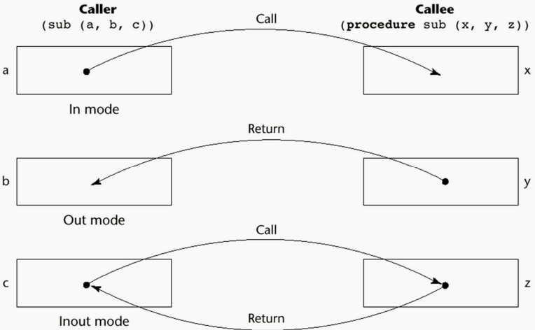
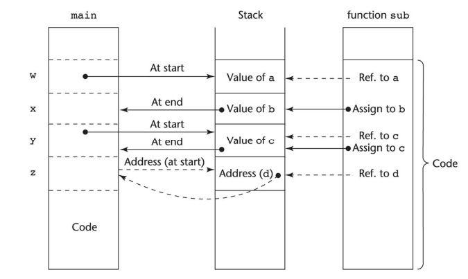
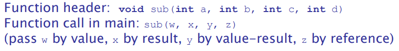
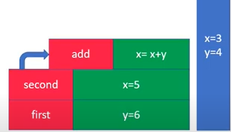
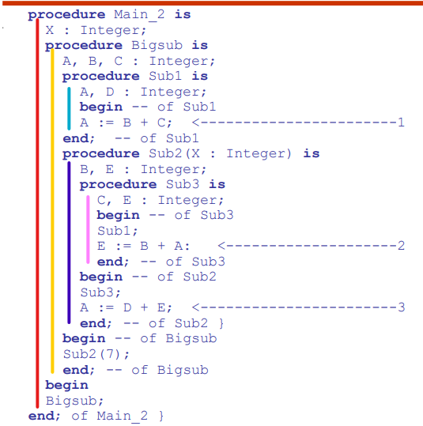
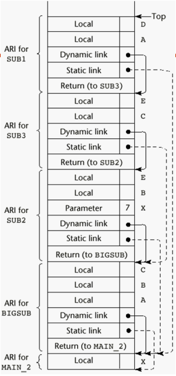

## Two fundamental abstraction facilities:

- Process abstraction (Discussed in this chapter)
- Data abstraction (Chapter 11)

## Fundamentals of subprograms

1. Each program has a single entry point
2. The calling program is suspended during execution of the called program
3. Control always returns to the caller when the called subprogram execution terminates

---

- A **subprogram definition** describes the interface to and the
  actions of the subprogram abstraction

- A **subprogram call** is an explicit request that the subprogram be executed

- A **subprogram header** is the first part of the definition,
  including the name, the kind of subprogram, and the formal
  parameters

- The **parameter profile** (aka signature) of a subprogram is the
  number, order, and types of its parameters
- The **protocol** is a subprogram’s parameter profile and, if it is
  a function, its return type
- A **subprogram declaration** provides the protocol, but not the
  body, of the subprogram

---

```
    def fun(x,y,sum) #formal parameters
    fun(4,LIST[A],sum) #actual parameters
```

`A formal parameter => is a dummy variable listed in the subprogram header. `

`An actual parameter => represents a value or address used in the subprogram call statement.`

- Positional

  - The binding of actual parameters to formal parameters is by position: the first actual parameter is bound to the first formal parameter and so forth
  - Safe and effective

  ```
  def add(augend, addend)
  add(1, 2)
  ```

- Keyword
  - The name of the formal parameter to which an actual parameter is to be bound is specified with the actual parameter
  - Advantage: Parameters can appear in any order, thereby avoiding parameter correspondence errors
  - Disadvantage: User must know the formal parameter’s names
  ```
  def add(augend, addend)
  add(augend: 1,addend: 2)
  ```

---

- In Python, function definitions are executable; in all
  other languages, they are non-executable
- In Ruby, function definitions can appear either in or
  outside of class definitions. If outside, they are
  methods of Object. They can be called without an
  object, like a function
- In Lua, all functions are anonymous

---

## What is the difference between Prodecures and functions?

- **Procedures** are collection of statements that define parameterized computations
- **Functions** structurally resemble procedures but are semantically modeled on mathematical functions

---

# Models of parameters passing



1. Pass-by-value (In Mode):
   The value of the actual parameter is used to
   initialize the corresponding formal parameter
2. pass-by-result (Out Mode)
3. Pass-by-value-result (Inout Mode)
4. Pass-by-refernce (Inout Mode)
5. Pass-by-Name (Inout Mode)

   
   

- C & C++ & C#
  - Pass-by-value | Pass-by-refernce (using pointers)
- Java
  - All parameters are Pass-by-value
  - Objects are pass-by-refernce
- Ada
  - in => default, out, in out
- Python & Ruby
  - pass-by-assignment

---

# Referncing Environment

- **_Shallow binding_**: The environment of the call statement that enacts the passed
  subprogram -
  - Most natural for dynamic-scoped languages
- **_Deep binding_**:The environment of the definition of the passed subprogram
  - Most natural for static-scoped languages
- **_Ad_hoc binding_**: The environment of the call statement that passed the subprogram

---

- Dynamic/Shallow => Takes the environment of the “final” calling function
- Static/deep => Takes the environment of the parent function
- Ad-hoc => Takes the environment of the calling function (where the function was passes as parameter)

```
x: integer := 3
y: integer := 4
procedure add
    x := x + y
procedure second (p: Procedure)
    x: integer := 5
    p()
procedure first
    y: integer := 6
    second (add) <=====
first()
write_integer(x)
```

```
Dynamic scoping/Shallow binding:
x = x + y = 5 + 6 = 11
Static Scoping/Deep binding:
x = x + y = 3 + 4 = 7
parent of add is second
```



---

```
def sub1():
  x = 1
  def sub2():
    print x
  def sub3():
    x = 3
    sub4(sub2)
  def sub4(f):
    x = 4
    f() <==== sub2 was called here
  sub3()
```

```
Dynamic scoping/Shallow binding:
x = 1
Static Scoping/Deep binding:
x = 4
ad-hoc bidning:
x = 3
```

---

```
procedure A
  int m

  procedure B(procedure X, int y)
    print X(y)

  procedure C(procedure X)
    int m = 10
    B(X, m)

  procedure D(int x) : int
    return x * m

  m = 1
  C(D)

Static: 10
Shallow/dynamic: 100
Deep/dynamic: 10

```

---

- **_Static Depth_** where function is located
- **_Chain Offset_** distance between the current subprogram to the subprogram where x was defined
- **_Local Offset_** where the variable is located inside the ARI block

---





---

# **_access to non-local vars using dynamic scoping_**

```
int r = 5
void show()
    print("%d", r)
void small()
    int x = 20
    show()
main()
    show()
    small()
    show()
    small()
```

```
output:
    5
    20
    5
    20
```

# Deep access method

- when you want to find a var search the stack from top to bottom looking for most recent activation record that contains space for desired vars
