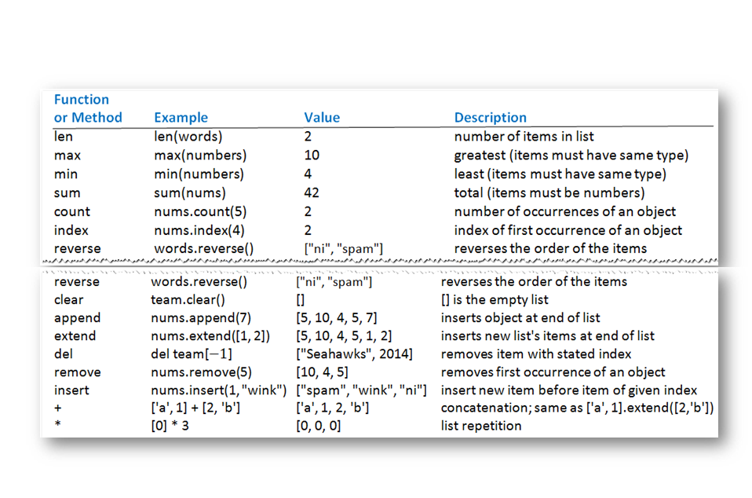
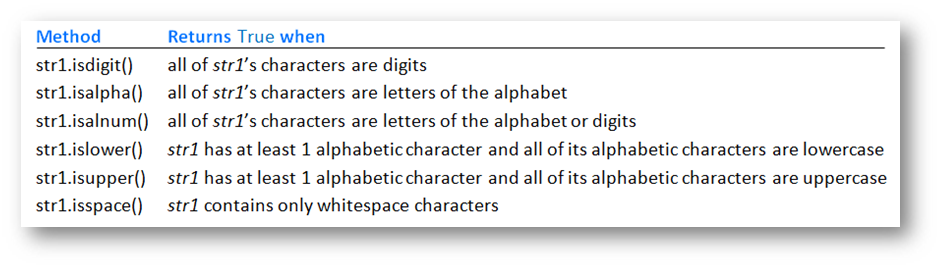

<div class="cell markdown">

> ## Strings

</div>

<div class="cell code">

```python
str1 = "Python"
str1.upper() # PYTHON
str1.lower() # python
str1.count("th") # 1
str1.capitalize() # Python
"pythOn cOde".title() # Python Code
"python code  ".rstrip() # python code removes spaces from the right side
```

</div>

<div class="cell markdown">

> chained methods

</div>

<div class="cell code" data-execution_count="2">

```python
# executed from left to right
numOfGs = "Good Doggie".upper().count('G')
```

</div>

<div class="cell code" data-execution_count="8">

```python
fullName = "Franklin Delano Roosevelt"
n = fullName.rfind(" ")
print(f"last name: {fullName[n+1:]}")
print(f"first name: {fullName[:n]}")
```

<div class="output stream stdout">

    last name: Roosevelt
    first name: Franklin Delano

</div>

</div>

<div class="cell markdown">

> ## Print

</div>

<div class="cell code" data-execution_count="11">

```python
print(1,2,3,sep="-")
print(1,end="<")
```

<div class="output stream stdout">

    1-2-3
    1<

</div>

</div>

<div class="cell code" data-execution_count="29">

```python
print("0123456789012345678901234567") # total 28
print("Rank".ljust(5), "player".ljust(20), "HR".rjust(3),sep="")
print("1".center(5), "Barry Bonds".ljust(20), "762".rjust(3),sep="")
print("2".center(5), "Hank Aaron".ljust(20), "755".rjust(3),sep="")
print("3".center(5), "Babe Ruth".ljust(20), "714".rjust(3),sep="")
```

<div class="output stream stdout">

    0123456789012345678901234567
    Rank player               HR
      1  Barry Bonds         762
      2  Hank Aaron          755
      3  Babe Ruth           714

</div>

</div>

<div class="cell code" data-execution_count="30">

```python
print("0123456789012345678901234567") # total 28
print("{0:^5s}{1:<20s}{2:>3s}".format("Rank","Player","HR"))
print("{0:^5n}{1:<20s}{2:>3n}".format(1,"Barry Bonds",762))
print("{0:^5n}{1:<20s}{2:>3n}".format(2,"Hank Aaron",755))
print("{0:^5n}{1:<20s}{2:>3n}".format(3,"Babe Ruth",714))
```

<div class="output stream stdout">

    0123456789012345678901234567
    Rank Player               HR
      1  Barry Bonds         762
      2  Hank Aaron          755
      3  Babe Ruth           714

</div>

</div>

<div class="cell code" data-execution_count="54">

```python
print("> {0:10d}".format(12345678))
print("> {0:10,d}".format(12345678))
print("> {0:10,.2f}".format(12345678.123))
print("> {0:10.2%}".format(12.345678))
```

<div class="output stream stdout">

    >   12345678
    > 12,345,678
    > 12,345,678.12
    >   1234.57%

</div>

</div>

<div class="cell code" data-execution_count="56">

```python
print("the area of {0:s} is {1:,d} square miles".format("Texas", 268820))
print("the population of {0:s} is {1:.2%} of the US population".format("Texas", 26448000 / 309000000))
```

<div class="output stream stdout">

    the area of Texas is 268,820 square miles
    the population of Texas is 8.56% of the US population

</div>

</div>

<div class="cell markdown">

> ## \[ Lists \]

</div>

<div class="cell code" data-execution_count="59">



<div class="output execute_result" data-execution_count="59">


</div>

</div>

<div class="cell code" data-execution_count="60">



<div class="output execute_result" data-execution_count="60">


</div>

</div>

<div class="cell markdown">

> ## custom sorting

</div>

<div class="cell code" data-execution_count="8">

```python
def main():
    l1 = ["democatric", "sequoia", "equals","brrr","break", "two"]
    l1.sort(key=len)
    print(l1)
    l1.sort(key=lastCharacter)
    print(l1)
    l2 = sorted(l1,key=numberOfVowels, reverse=True)
    print(l2)
def lastCharacter(word):
    return word[-1]
def numberOfVowels(word):
    vowels = ('a','e','i','o','u')
    total = 0
    for vowel in vowels:
        total += word.count(vowel)
    return total
main()
```

<div class="output stream stdout">

    ['two', 'brrr', 'break', 'equals', 'sequoia', 'democatric']
    ['sequoia', 'democatric', 'break', 'two', 'brrr', 'equals']
    ['sequoia', 'democatric', 'equals', 'break', 'two', 'brrr']

</div>

</div>

<div class="cell code" data-execution_count="10">

```python
# sort by last name using lambda
names = ["Dennis Ritchie","Alan Kay","John Backus","James Gosling"]
names.sort(key=lambda name: name.split()[-1])
nameStr = ", ".join(names)
print(nameStr)
```

<div class="output stream stdout">

    John Backus, James Gosling, Alan Kay, Dennis Ritchie

</div>

</div>

<div class="cell markdown">

> ## List Comprehension

</div>

<div class="cell code" data-execution_count="13">

```python
# L = [f(x) for x in list1]
# [g(x) for x in list1 if x % 2 == 1]
print([ord(x) for x in 'abc'])
print([x ** .5 for x in (4,-1,9) if x >=0])
print([x ** 2 for x in range(3)])
```

<div class="output stream stdout">

    [97, 98, 99]
    [2.0, 3.0]
    [0, 1, 4]

</div>

</div>
