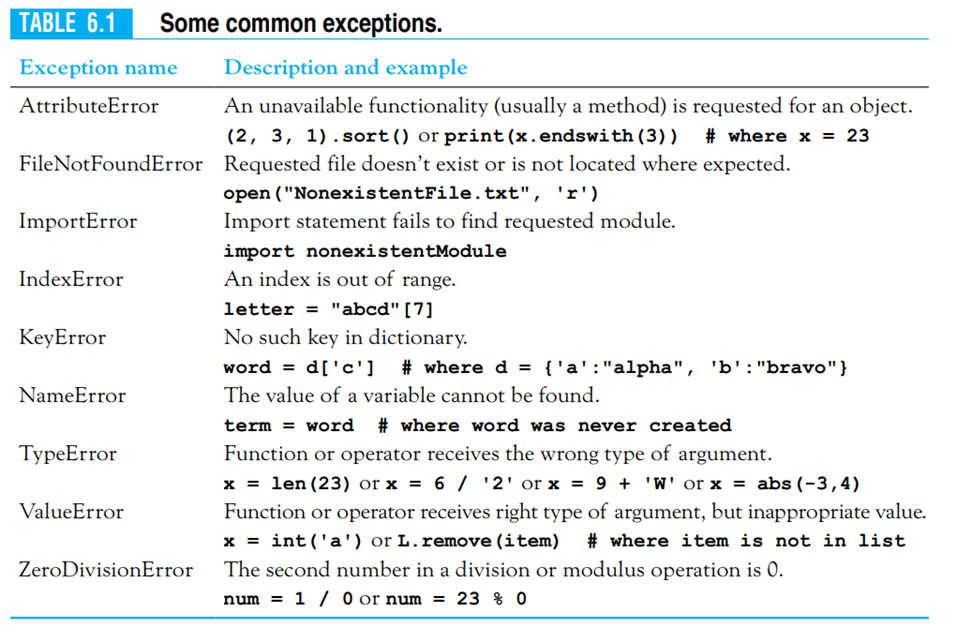

<div class="cell code" data-execution_count="6">



<div class="output execute_result" data-execution_count="6">


</div>

</div>

<div class="cell code">

``` python
try:
    numDependents = int(input("Enter num of dependentts: "))
except ValueError as exp:
    print(exp)
    print("\nanswer not an integer\nwe will assume your answer is 0")
    numDependents = 0
taxCredit = 1000 * numDependents
print("Tax credit: ",taxCredit)
```

</div>

<div class="cell markdown">

`except:` when any exception occurs

`except ExceptionType:` when exceptionType occurs

`except ExceptionType as exp` exp returns info of the error

</div>

<div class="cell code" data-execution_count="14">

``` python
def main():
    try:
        fileName = "assets/" + input("enter the name of the file('Number.txt')")
        f = open(fileName,'r')
        num = float(f.readline())
        print(1/num)
    except FileNotFoundError as exp1:
        print(exp1)
    except ValueError as exp2:
        print(exp2)
main()
```

<div class="output stream stdout">

    [Errno 2] No such file or directory: 'assets/a'

</div>

</div>

<div class="cell code">

``` python
def main():
    phoneticAlphabet = {'a':"alpha",'b':"bravo", 'c':"charlie"}
    flag = True
    while flag:
        try:
            letter = input("Enter a, b, or c: ").lower
            print(phoneticAlphabet[letter])
            flag = False
        except KeyError:
            print("Unvalid letter\n")
main()
```

</div>

<div class="cell code" data-execution_count="5">

``` python
def main():
    total = 0
    counter = 0
    foundFlag = True
    try:
        f = open("assets/avgNums.txt",'r')
    except FileNotFoundError:
        print("file not found.")
        foundFlag = False
    if foundFlag:
        try:
            for line in f:
                counter += 1
                total += float(line)
            print(f"avg: {total/counter}")
        except ValueError:
            print(f"Line {counter} could not be converted to a float")
            if counter > 1:
                print(f"Average so far: {total/counter-1}")
            else:
                print("at least 1 num is needed to calculate avg")
                print("file is empty")
        except ZeroDivisionError:
            print("file was empty")
        else:
            print("Total: ", total)
        finally:
            f.close()
main()
```

<div class="output stream stdout">

    Line 5 could not be converted to a float
    Average so far: 2.2

</div>

</div>
